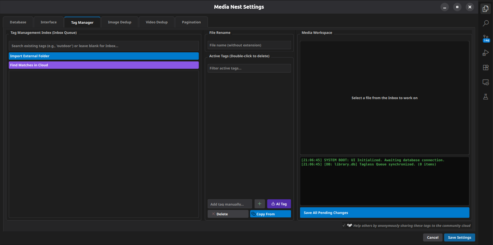

<table>
<tr>
<td>

# Media-Nest

Media-Nest is a desktop application for organizing, browsing, and managing large collections of photos and videos stored on your computer. It is built to stay responsive while handling thousands of files by using background processing and multithreading for tasks that take longer to complete.

</td>

<td align="right">

</td>
</tr>
</table>

  

<h2>Core Features</h2>

Media-Nest includes a range of tools for organizing and managing your media library. The interface uses a clean dark theme inspired by modern desktop applications, making it comfortable to use for long periods.

<h3>Media Organization</h3>

Browse your folders and media collections through a simple tree navigation system that makes it easy to move around large libraries.

<ul>
  <li>
    <strong>Multi Tag Search:</strong>
    Search your library using multiple tags at the same time. You can include the tags you want while excluding others to quickly narrow down your results.
  </li>
</ul>

<h3>Duplicate Detection</h3>

Media-Nest includes built in tools for finding duplicate files and helping you free up storage space.

<ul>
  <li>
    <strong>Image Deduplication:</strong>
    Uses perceptual hashing to detect both exact duplicates and visually similar images.
  </li>

  <li>
    <strong>Video Deduplication:</strong>
    Uses FFmpeg together with a video duplicate finder backend to scan your video library for duplicate files.
  </li>
</ul>

  

<h3>AI Auto Tagging</h3>

Media-Nest includes an AI based tagging system that can automatically add tags to your media and reduce the amount of manual work needed to organize large collections.

<ul>
  <li>
    <strong>Hardware Acceleration:</strong>
    Supports ONNX Runtime with CPU, NVIDIA CUDA, and DirectML, allowing the AI features to run on the hardware available on your system.
  </li>

  <li>
    <strong>Automatic Tagging:</strong>
    Analyzes images and video frames to predict characters and apply tags. A customizable fallback system can also assign tags based on visual features such as hair color and eye color.
  </li>
</ul>

<h3>Media Viewers</h3>

Media-Nest includes dedicated viewers for different types of media.

<ul>
  <li>
    <strong>Video Player:</strong>
    Includes custom playback controls, volume adjustment, looping, and a detachable viewer that works well on multi monitor setups.
  </li>

  <li>
    <strong>Comic Reader:</strong>
    Supports both continuous vertical scrolling for webtoons and paginated reading for manga and comics.
  </li>
</ul>

<h2>How It Works</h2>

The application performs most heavy tasks in the background so you can continue browsing your library without interruptions.

<ul>
  <li>
    <strong>Getting Started:</strong>
    Open your media library or load an existing SQLite database that contains your tags and metadata.
  </li>

  <li>
    <strong>Background Processing:</strong>
    Media-Nest scans folders, generates thumbnails, and extracts video frames in the background while the interface remains responsive.
  </li>

  <li>
    <strong>Searching:</strong>
    Use the sidebar search to find specific tags. Matching files and folders are loaded directly from the database.
  </li>

  <li>
    <strong>Viewing Media:</strong>
    Open images in the built in image viewer, play videos directly, or open image folders in the comic reader.
  </li>
</ul>

<h2>Installation</h2>

Media-Nest requires Python 3.10 or later. The main dependencies include PyQt6, ONNX Runtime, OpenCV, Pillow, and ImageHash.

<h3>Installation Steps</h3>

<ol>
  <li>Clone the repository.</li>

  <li>
    Install the required Python packages. If you have an NVIDIA GPU, you can install <code>onnxruntime-gpu</code> instead of the standard ONNX Runtime package for faster AI tagging.
  </li>
</ol>

<pre><code>pip install -r requirements.txt</code></pre>

<ol start="3">
  <li>Run the main Python file to start the application.</li>
</ol>

<h3>First Time Setup</h3>

<ul>
  <li>Choose the location for your primary database when prompted.</li>

  <li>
    If you plan to use video duplicate detection, open the corresponding tab and download the required FFmpeg and command line tools.
  </li>

  <li>
    Interface scaling can be adjusted by editing the configuration JSON file in the project directory.
  </li>
</ul>

<h2>Project Structure</h2>

The project is organized into separate components to keep the code easier to maintain.

<ul>
  <li>
    <strong>Main Entry Point:</strong>
    Starts the application, loads the configuration, applies interface scaling, and creates the main window.
  </li>

  <li>
    <strong>Application Logic (Src/Logic/app.py):</strong>
    Connects the user interface with the background workers, manages thumbnail generation, database operations, and media playback.
  </li>

  <li>
    <strong>User Interface (Src/Ui/interface.py):</strong>
    Contains the application layout, styling, and custom widgets including the image viewer and video controls.
  </li>

  <li>
    <strong>Background Workers:</strong>
    Files such as <code>Src/Logic/deduplication.py</code> and <code>Src/Logic/video_dedup.py</code> perform duplicate detection and other background tasks.
  </li>

  <li>
    <strong>AI Engine (Src/Logic/visual_sorter.py):</strong>
    Loads ONNX models and generates automatic tags for images and videos.
  </li>

  <li>
    <strong>Comic Reader (Src/Ui/reader_widget.py):</strong>
    Handles smooth rendering and navigation for comic and manga pages.
  </li>
</ul>

<h2>Usage Tips</h2>

<ul>
  <li>
    <strong>Detach Viewer:</strong>
    Use the Detach Viewer option to open the media viewer in a separate window for multi monitor setups.
  </li>

  <li>
    <strong>Image Zoom:</strong>
    Double click an image to view it at its original resolution and navigate using the mouse or scrollbars.
  </li>

  <li>
    <strong>AI Performance:</strong>
    For the best AI tagging performance, install the ONNX Runtime version that matches your hardware, such as CUDA for NVIDIA GPUs or DirectML for AMD and Intel GPUs.
  </li>
</ul>
