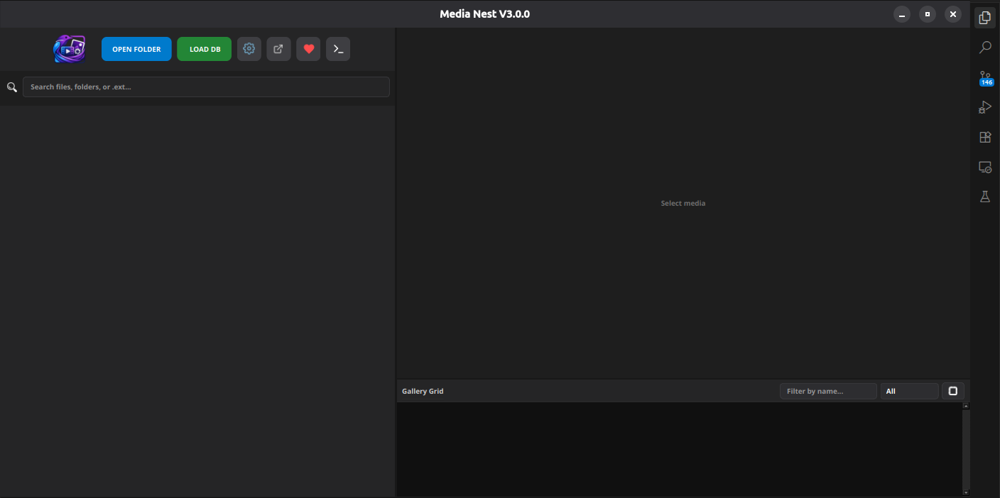
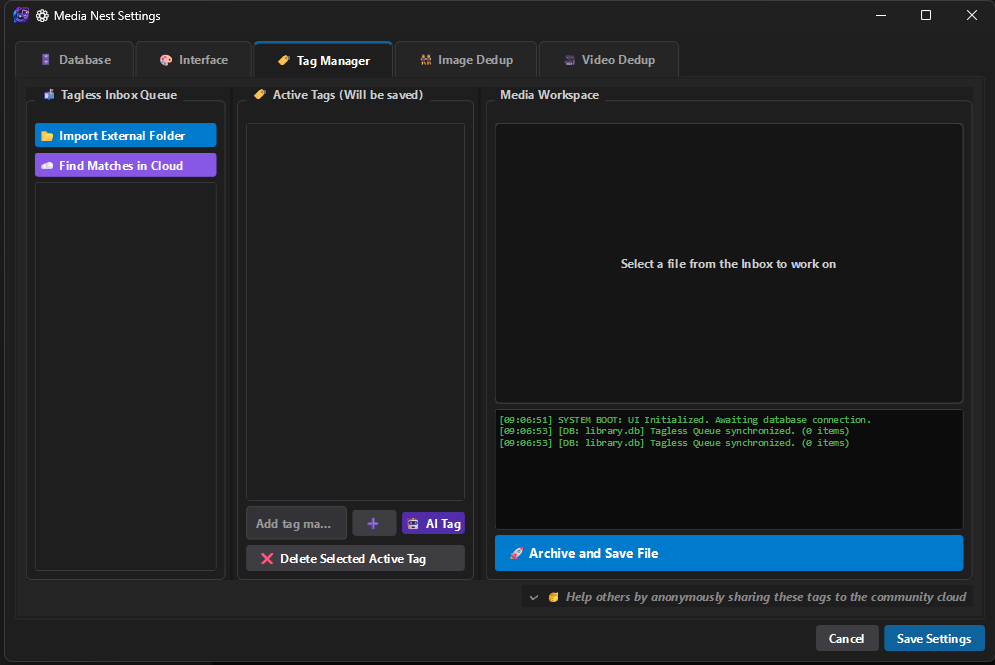

<table>
<tr>
<td>

# Media-Nest

Media-Nest is a desktop application built to help you organize, browse, and manage large collections of photos and videos stored on your computer. It's designed with performance in mind, using multithreading and background processing to keep everything fast and responsive, even when you're working with thousands of files.

</td>

<td align="right">

</td>
</tr>
</table>

  

<h2>Core Features and Capabilities</h2>

The application offers a variety of advanced features to help you manage your media library efficiently. The user interface is designed with a premium, dark-themed aesthetic inspired by modern professional IDEs, minimizing eye strain during extended organizing sessions.

<h3>Intelligent Media Organization</h3>

Navigating through your media is streamlined by a smart tree navigation system that lets you effortlessly browse folders and galleries.

<ul>
  <li>
    <strong>Multi-Tag Search:</strong>
    A highly intelligent search bar allows you to quickly filter your entire library by combining inclusive and exclusive tags. For example, you can search for a specific character while explicitly excluding another.
  </li>
</ul>

<h3>Advanced Duplicate Detection</h3>

When it comes to managing duplicate content, Media-Nest offers robust tools to help you reclaim valuable storage space.

<ul>
  <li>
    <strong>Image Deduplication:</strong>
    Utilizes perceptual hashing (pHash) algorithms to cluster and identify visually similar or exact duplicate images.
  </li>

  <li>
    <strong>Video Deduplication:</strong>
    Integrates with a powerful backend CLI engine, utilizing FFmpeg and a specialized Video Duplicate Finder engine to scan your video library for exact matches.
  </li>
</ul>

  

<h3>AI-Powered Auto-Tagging</h3>

To drastically reduce the manual labor involved in organizing a large collection, Media-Nest includes an AI-powered auto-tagging system accessible through the tag manager.

<ul>
  <li>
    <strong>Hardware Acceleration:</strong>
    Leverages the ONNX runtime, supporting CPU, NVIDIA CUDA, and DirectML execution providers to run efficiently on your specific hardware.
  </li>

  <li>
    <strong>Smart Predictions:</strong>
    Analyzes images and video frames to automatically predict characters and apply tags, using a customizable fallback rule system based on visual traits like hair and eye color.
  </li>
</ul>

<h3>High-Performance Viewers</h3>

Media-Nest excels in media playback and viewing, providing specialized tools for different types of content.

<ul>
  <li>
    <strong>Video Player:</strong>
    Features custom timeline controls, volume sliders, looping functionality, and a detached viewer mode that is perfect for multi-monitor setups.
  </li>

  <li>
    <strong>Comic Readers:</strong>
    Provides specialized virtual readers capable of handling infinite vertical scrolling (ideal for manhwa) as well as classic paginated reading for manga.
  </li>
</ul>

<h2>System Workflow and Usage</h2>

Managing your media library is a straightforward process designed to be seamless and non-blocking. A swarm of background worker threads handles resource-intensive tasks without freezing the main user interface.

<ul>
  <li>
    <strong>Initialization:</strong>
    Point the application to your media library or load an existing SQLite database containing your tags and metadata.
  </li>

  <li>
    <strong>Background Processing:</strong>
    The application asynchronously scans your directories, generating thumbnails and extracting video frames in the background.
  </li>

  <li>
    <strong>Navigation:</strong>
    Use the sidebar search to find specific tags. The application will instantly query the database to update the main view with relevant files or galleries.
  </li>

  <li>
    <strong>Viewing:</strong>
    Click an image to open it in the native viewer (double-click to zoom and pan), click a video to play it instantly, or open a folder of images to trigger the high-performance comic reader.
  </li>
</ul>

<h2>Setup and Installation</h2>

The application requires Python 3.10 or higher. You will need to install the following dependencies: PyQt6, ONNX Runtime, OpenCV, Pillow, and ImageHash.

<h3>Installation Steps</h3>

<ol>
  <li>Clone the repository to your local machine.</li>

  <li>
    Install the required dependencies using pip. If you have an NVIDIA GPU, it is highly recommended to install <code>onnxruntime-gpu</code> instead of the standard package to speed up the AI auto-tagging process.
  </li>
</ol>

<pre><code>pip install PyQt6 pillow imagehash onnxruntime opencv-python send2trash requests</code></pre>

<ol start="3">
  <li>Launch the application by running the main Python script.</li>
</ol>

<h3>First-Time Configuration</h3>

<ul>
  <li>Upon launching, you may be prompted to set your primary database folder.</li>

  <li>
    If you intend to use the video deduplication feature, navigate to that tab and use the provided button to download the required FFmpeg and CLI binaries.
  </li>

  <li>
    You can adjust your custom UI scaling settings by modifying the configuration JSON file located in the root directory.
  </li>
</ul>

<h2>Project Structure Overview</h2>

The architecture of the application is divided into logical components for easier maintenance and development.

<ul>
  <li>
    <strong>Main Entry Point:</strong>
    Handles portable configuration, UI scaling, Windows taskbar integration, and launches the main application window.
  </li>

  <li>
    <strong>Application Logic (Src/Logic/app.py):</strong>
    Responsible for binding the user interface to the background workers. It manages the thumbnail generation swarm, handles database queries, and controls the media players.
  </li>

  <li>
    <strong>User Interface (Src/Ui/interface.py):</strong>
    Defines the layout, styling, and custom widgets, such as the smart scaling image viewer and custom video controls.
  </li>

  <li>
    <strong>Background Workers:</strong>
    Modules like <code>Src/Logic/deduplication.py</code> and <code>Src/Logic/video_dedup.py</code> handle the heavy lifting for finding duplicate content.
  </li>

  <li>
    <strong>AI Engine (Src/Logic/visual_sorter.py):</strong>
    Loads ONNX models to analyze media frames and predict tags.
  </li>

  <li>
    <strong>Specialized Widgets (Src/Ui/reader_widget.py):</strong>
    Used specifically to render comic and manga pages smoothly.
  </li>
</ul>

<h2>Usage Tips</h2>

<ul>
  <li>
    <strong>Multi-Monitor Setup:</strong>
    Click the Detach Viewer button in the sidebar to pop the media player out into its own floating window.
  </li>

  <li>
    <strong>Zooming:</strong>
    Double-clicking any static image will zoom in to its native resolution, allowing you to use the scrollbars or mouse wheel to navigate.
  </li>

  <li>
    <strong>Hardware Acceleration:</strong>
    If the AI auto-tagger is running slowly, ensure you have the correct ONNX runtime installed and configured in your settings (CUDA for NVIDIA, DirectML for AMD/Intel).
  </li>
</ul>
